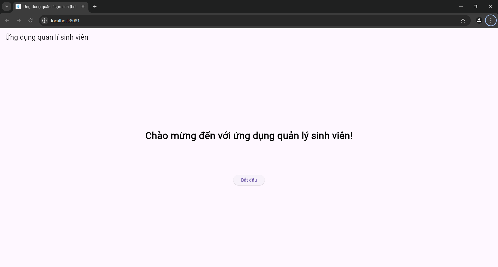
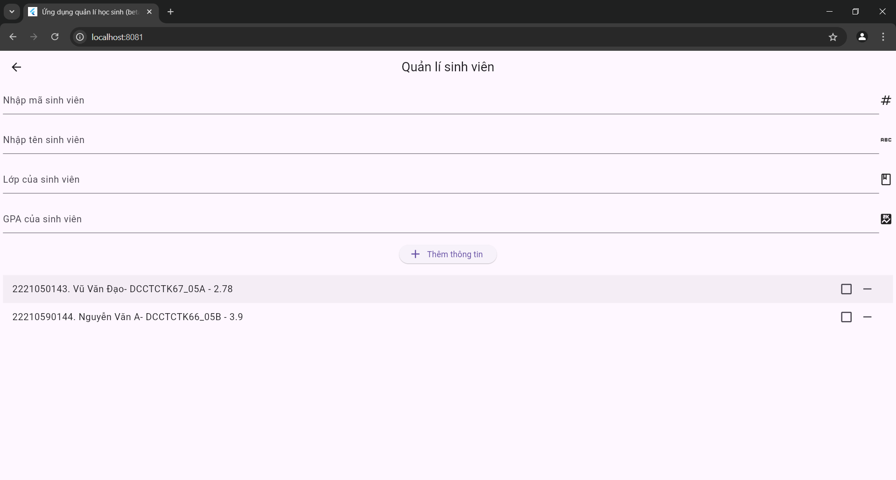
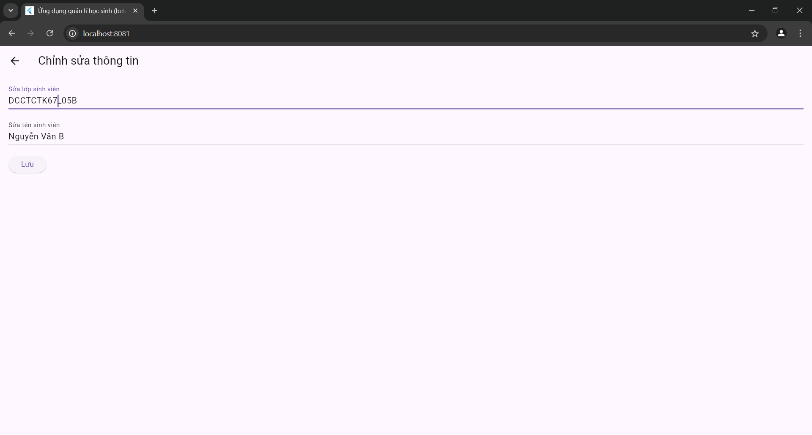
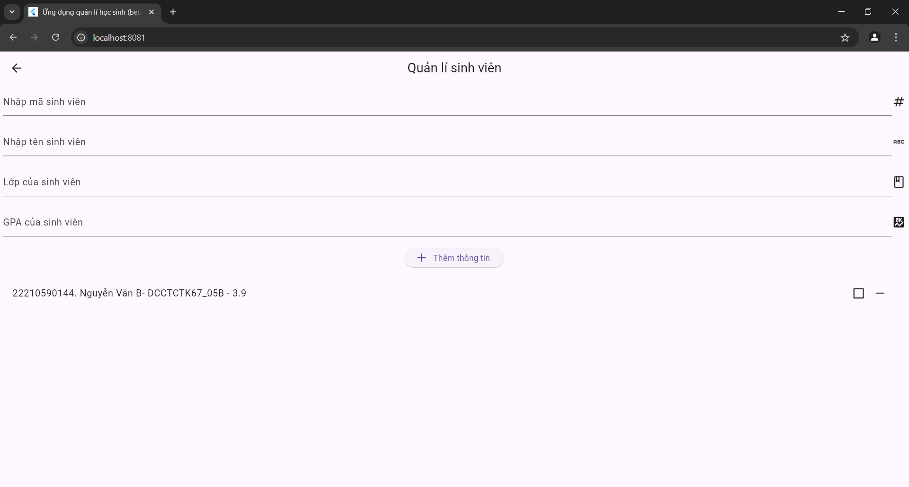

# Bài tập lớn - Phát triển ứng dụng với Flutter

## Thông tin sinh viên

- **Họ và tên**: Vũ Văn Đạo
- **MSSV**: 2221050143
- **Lớp**: DCCTCTK67_05A

## Tên ứng dụng : Quản lí thông tin sinh viên

## Chức năng của ứng dụng

### 1. Chức năng CRUD

- Ứng dụng cung cấp đầy đủ các chức năng CRUD (Create, Read, Update, Delete)
- Mỗi đối tượng có các thuộc tính cơ bản như:
  - **msv**: Định danh duy nhất cho mỗi sinh viên.
  - **ten**: tên của sinh viên.
  - **lop**: lớp của sinh viên.
  - **gpa**: điểm của sinh viên.
  - **Điểm danh**: dùng để điểm danh sinh viên.

## Báo cáo kết quả

1. Tải mã nguồn từ repository.

   ```bash
   git clone https://github.com/VuVanDao/Final_project_2221050143_VuVanDao_DCCTCTK67_05A.git
   ```

2. Cài đặt các dependencies:
   ```bash
   flutter pub get
   ```
3. Chạy ứng dụng:
   ```bash
   flutter run
   ```
4. Kiểm tra ứng dụng trên thiết bị hoặc máy ảo , thực hiện các thao tác CRUD và kiểm tra kết quả.

   trang homepage:
   
   phần quản lí ghi, chỉnh sửa, xoá sinh viên  
    
   
   xoá sinh viên 2221050143:
   

5. Thực hiện kiểm thử tự động và xem kết quả:
   ```bash
   flutter test
   ```

# Tự chấm điểm

6 điểm
